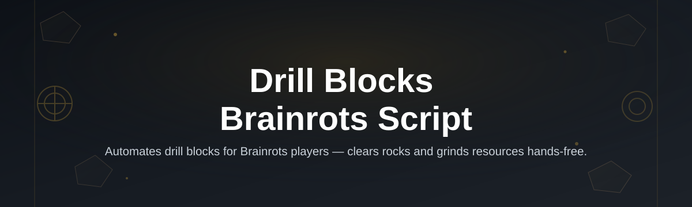

# drill-blocks-brainrot-script

*A focused Drill Blocks placement tool for the Brainrots minigame — for players who want a repeatable layout instead of guessing corners.*

## Quick start

**TL;DR: download, extract, run — you're placing Drill Blocks in under two minutes.**

1. Open the landing page and grab the latest build.
2. Extract the folder anywhere on your Windows machine — no installer, no admin prompt.
3. Launch the executable and load your Drill Blocks layout profile.

That's the whole onboarding. Everything below explains *why* it works this way.

## Drill Blocks for Brainrots Script vs. doing it manually

**TL;DR: manual placement is fine for one round, painful for fifty. This tool exists for the fifty.**

| | Manual placement | Generic macro tools | drill-blocks-brainrot-script |
|---|---|---|---|
| Setup time | None | 10–20 min config | Under 2 min |
| Consistency across rounds | Low (human error) | Medium | High (fixed layout logic) |
| Built for Brainrots specifically | N/A | Rarely | Yes |
| Requires scripting knowledge | No | Often yes | No |
| Installation footprint | None | Sometimes heavy | Standalone, portable |

## What this is

**TL;DR: it's a standalone Windows tool that automates Drill Block placement inside the Brainrots minigame, so your layout is consistent instead of eyeballed.**

Drill Blocks for Brainrots Script is a small, purpose-built utility for players of the Brainrots minigame who want their Drill Blocks arranged the same reliable way every round. Instead of manually clicking each block into position and hoping the spacing lines up with your farm layout, this tool reads your target grid and drops the blocks in a consistent, repeatable pattern. It's not a general-purpose automation framework — it does one job, and it does it the same way every time.

The project ships as a single Windows executable with no installation step and no external dependencies. You don't need to know anything about scripting, config files, or the internals of Brainrots to use it — you download the build, run it, and it handles the placement logic for you. Everything documented in this README describes exactly that tool: a Drill Blocks placement helper for the Brainrots minigame, nothing broader.

  

The button above opens the project's landing page, where the current build is available to download.

## Who it is for

**TL;DR: built for repeat Brainrots players, not casual one-off games.**

- Players who run Brainrots sessions daily and don't want to re-place Drill Blocks by hand each time.
- Farm-layout tinkerers who want a fixed, repeatable block grid to test against different setups.
- Players coming back after a break who forgot their old layout and want a clean baseline fast.
- Anyone on Windows who wants a lightweight, no-fuss tool without installing anything extra.
- Content creators who need consistent Drill Block placement across recorded runs for comparison.

## What you can do

**TL;DR: place, repeat, and adjust your Drill Blocks without touching a config file.**

- **Auto-place Drill Blocks** in a consistent grid pattern across your Brainrots layout.
- **Reuse the same layout** across multiple rounds without redoing the setup by hand.
- **Run it standalone** — no background service, no install wizard, just the executable.
- **Skip the manual clicking** that eats up time between rounds.
- **Keep results consistent** so you can actually compare farm layouts side by side.
- **Launch and close freely** — nothing lingers running in the background afterward.
- **Use it on a fresh Windows machine** without setting up any dependencies first.
- **Update by re-downloading** the build from the landing page whenever a new version lands.

## Getting started

**TL;DR: three clicks and you're placing blocks — no setup wizard involved.**

1. Visit the landing page linked by the download button above.
2. Download the latest build for Windows.
3. Extract the downloaded folder to any location on your drive.
4. Run the executable directly — no installer will launch.
5. Load or start a Brainrots session and let the tool handle Drill Block placement.

## Requirements

**TL;DR: Windows 10 or 11, nothing else.**

- Windows 10 or Windows 11 (64-bit).
- No .NET runtime, Python, or Node install needed — the build is standalone.
- No build toolchain, compiler, or IDE required.
- A working Brainrots session to place blocks into.

## How it works

**TL;DR: it reads the grid, calculates spacing, and drops blocks in order.**

The tool follows a short, predictable sequence rather than anything adaptive or "smart" — that predictability is the point.

1. The executable starts and checks the active Brainrots window.
2. It reads the current grid dimensions for Drill Block placement.
3. A fixed spacing pattern is calculated for the layout.
4. Drill Blocks are placed in sequence according to that pattern.
5. The tool idles, ready for the next round or a manual re-run.

## FAQ

**TL;DR: the short answers to what people actually ask before downloading.**

**Is this specific to the Brainrots minigame, or does it work in other games?**
It's built specifically around Brainrots' Drill Block mechanic. It doesn't attempt to generalize to other games.

**Do I need to configure anything before my first run?**
No. The default layout works out of the box; adjustments are optional, not required.

**Does it need admin rights to run on Windows?**
No. It runs as a normal user-level executable with no elevated permissions.

**Will it work if my Brainrots layout is unusual or non-standard?**
It's tuned for standard grid layouts. Highly irregular setups may need manual placement afterward for edge blocks.

**How do I get updates when a new build is released?**
Check the landing page periodically and download the newest build — there's no auto-update mechanism built in.

## Troubleshooting

**TL;DR: most issues are window focus, antivirus, or an outdated build.**

- **Tool doesn't detect the Brainrots window** — make sure the game window is focused and not minimized before launching the tool.
- **Windows flags the executable on first run** — this is common for unsigned standalone builds; allow it through your antivirus if you trust the source.
- **Blocks place in the wrong spot** — confirm your grid hasn't shifted since the last session; restart the tool to re-read the layout.
- **Nothing happens after launch** — check you extracted the full folder rather than running the executable from inside a compressed archive.

## License

Released under the [MIT License](LICENSE). Use it, modify it, share it — just don't expect a warranty. This project is provided as-is with no guarantee it fits every Brainrots layout or every future game update.

  

